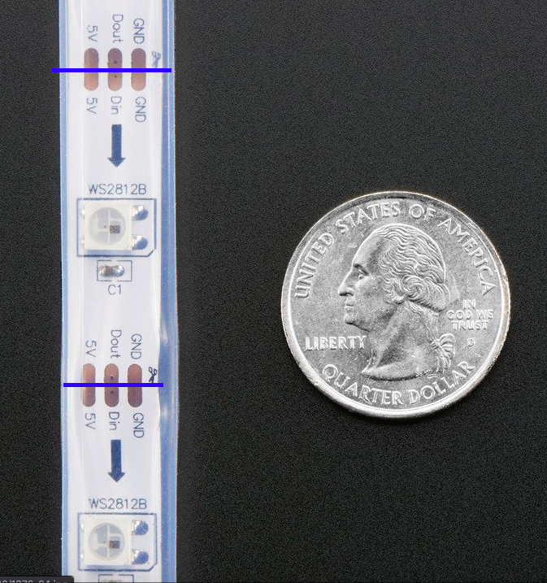

# LED shelves
Instructions to create a customizable LED bookshelf. I got asked how I did this when I posted it on twitter so I figured I would write out some instructions since I had to figure out a lot of this myself, maybe it will help someone.

[This](https://www.youtube.com/watch?v=-vMah2H9-WQ&ab_channel=NadiaTokerud) cool youtube video is where I initially got the idea. It linked to [this](https://github.com/oyvindmb/bookworm/wiki) tutorial on github by the creator of the first video. 

## Equipment
* Arduino Uno
* [RGB LED neopixel strips](https://www.adafruit.com/product/1376?length=1)
* USB 2.0 Cable type A/B
* Soldering iron
* Wire strippers
* Multimeter
* [22 AWG wires](https://www.adafruit.com/product/1311)
* hot glue gun
* Power supply
* Desoldering pump

## Connecting everything together
First you have to test your neopixel strip(s). To do this you need an arduino and the [arduino IDE](https://create.arduino.cc/projecthub/Arduino_Genuino/getting-started-with-arduino-web-editor-on-various-platforms-4b3e4a).  

Once you have the IDE, you need to install the library that will allow you to control neopixels. To do this from the toolbar: 
Tools> Manage Libraries > Type 'adafruit neopixel' in the search bar and install , now you can include and use it in your project.

[Here](https://learn.adafruit.com/1500-neopixel-led-curtain-with-raspberry-pi-fadecandy/test-components) is some good test code from adafruit's website, just paste it into the IDE.

Where it says `#define pin 6` that is the corresponding pin on the arduino that your data wire will go into. Your ground wire will go into a `GND` slot, and your power wire will go into the `5V` slot. Once that's connected make sure your board is properly connected to the program, you can use a USB 2.0 Cable type A/B for this. 

Ports > look for the right one

Tools > board> Select Arduino Uno

Now you can press 'verify' and 'upload' on the IDE, you should immediately see the LEDs light up.

[This](https://www.youtube.com/watch?t=107&v=EvRxQbhDxCo&feature=youtu.be&ab_channel=KamuiCosplay) is a good video that walks you through the steps in this section, I would watch from 1:47-5:00

[Rainbow Cycle](https://www.tweaking4all.com/hardware/arduino/adruino-led-strip-effects/#LEDStripEffectRainbowCycle) is the code I used for my animation

## Segmenting the strips
This was the most time consuming part. You want to cut up your strips to lengthen the distance between neopixels. I used 3 neopixels per square. You can use scissors to cut through the middle of the pads.

Then you have to reconnect them with your wires at your desired distance by [soldering](https://www.youtube.com/watch?t=107&v=EvRxQbhDxCo&feature=youtu.be&ab_channel=KamuiCosplay) and [desoldering](https://www.youtube.com/watch?v=N_dvf45hN6Y&ab_channel=AdafruitIndustries) using a desoldering pump when you make a mistake. '

[Here](https://www.youtube.com/watch?v=U_b08YRcY4s&ab_channel=SuperBrightLEDs) is a good video about soldering LED strips, you can burn off a pad if you hold it under the heat for too long and then you cannot use it anymore but that doesn't happen too often. 

Sometimes you can get a short where two pads that are next to each other are touching, or the wire is not well connected to the pad and isn't passing current. That's why using the [continuity test](https://www.youtube.com/watch?v=5G622WDZaHg&ab_channel=GalcoTV) by using a multimeter to constantly test the circuit is really helpful. Once the three wires are functional I used a hot glue gun to set the wires into place.

Disclaimer: Be careful when handling electric components and ensure your power supply can handle the LEDs if you have a lot of them. 

## other cool stuff

Control LED strips or other IOT devices using your phone using the blynk app, [here](https://examples.blynk.cc/?board=Arduino%20Uno&shield=Serial%20or%20USB&example=Widgets%2FLED%2FLED_Color) is an example.
